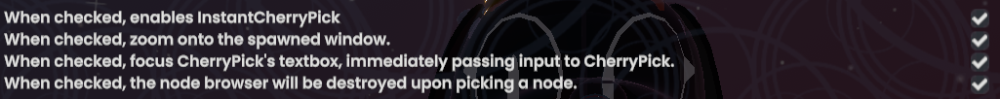

# QuickPick
A [ResoniteModLoader](https://github.com/resonite-modding-group/ResoniteModLoader) mod that lets you quickly pick ProtoFlux nodes and components in desktop mode.

## Usage

There are two ways of invoking QuickPick. Firstly is by having a ProtoFlux Tool equipped, and by using the CTRL+G shortcut to spawn the ProtoFlux node browser.

Secondly is by holding the shift key while doing an action that opens the component browser, e.g. holding shift while clicking on 'Add Component' in an inspector, or while clicking 'Browse nodes' in your context menu.

## Settings

## Installation
1. Install [ResoniteModLoader](https://github.com/resonite-modding-group/ResoniteModLoader).
1. Place [QuickPick.dll](https://github.com/jvyden/QuickPick/releases/latest/download/QuickPick.dll) into your `rml_mods` folder. This folder should be at `C:\Program Files (x86)\Steam\steamapps\common\Resonite\rml_mods` for a default install. You can create it if it's missing, or if you launch the game once with ResoniteModLoader installed it will create this folder for you.
1. It is also highly recommended to install [CherryPick](https://cyro.blue/cyro/CherryPick) for its searching functionality. This mod has integration to automatically focus the search bar.
1. Start the game. If you want to verify that the mod is working, you can check your Resonite logs.